# Kafka 高可用性(HA)實作技術文件

## 一、基礎概念

### Kafka 重要名詞解釋

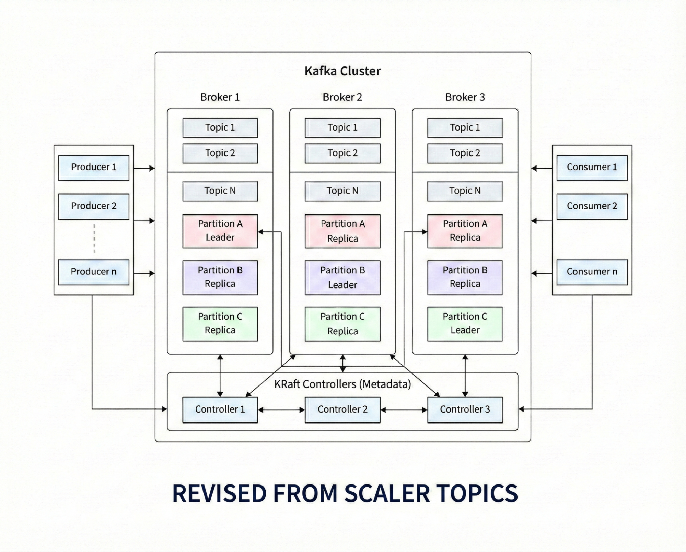

Revised by Gemini, origin: <https://www.scaler.com/topics/kafka-tutorial/kafka-partitioning-strategy/>

以下Kafka元素解釋取自[Kafka超新手入門第一瞥](https://chrisyen8341.medium.com/kafka%E8%B6%85%E6%96%B0%E6%89%8B%E5%85%A5%E9%96%80%E7%AC%AC%E4%B8%80%E7%9E%A5-9348a9cb23dc)，並進行微幅的文字修改。

1. Event：事件或是 message ，或想成一筆資料流，比如說 “Alice Made a payment of $200 to Bob” 就是一筆 message 或是 event 。
2. Broker：運行 Kafka 的 Server ，通常 Kafka 會由多台 Broker 組成，多台 Broker 會組成一個 Kafka Cluster 。此外，叢集中的每一台 Broker 也會隨機擔任特定 Consumer Group 的Group Coordinator ，負責管理該群組成員的健康狀態 (Heartbeat) 並協助觸發 Rebalance 流程。
3. Topic：儲存訊息的地方，類似於資料庫中的Table，但它是一直 append 且先進先出的。
4. Partition：每個 Topic 可以自定義切成多個 Partition ，每個 Partition 可能分散在不同的 Broker ，這使 Consumer 能同時讀取多台 Broker 上的 Partition ；一筆資料只會寫入一個 Partition ，且同 Key 的資料會寫入同一個 Partition (沒有 Key 值則 round robin 寫入)。
5. Offset：每個 Partition 中的資料具順序性。每筆資料寫入一個 Partition 時都會有一個的 ID 叫作 Offset ，用以紀錄當前／最後的讀寫位置。
6. Replication：每個 Topic 在創建時會指定 replication-factor 的值，這個數值會影響到該 Topic 的 Partition 會有幾個複製備份(replica，通常是3)。 Kafka 會將不同的備份儲存在不同 Broker 主機，以達成高可用性；當某台主機壞損時，還有不同的備份在其他台，多個備份中只會有一個是主要讀寫對象(Leader)，其他都是 in sync replica (ISR)。
7. Producer & Consumer：Producer 為產生資料寫入 Kafka 的 Client 應用系統 ; Consumer 訂閱並消費 Kafka 產生資料的 Client 應用系統。他們彼此之間不須認識，亦即解耦(decoupled)。
8. Controller (KRaft Controller)：它是 Kafka Cluster 的「大腦」。在舊版 Kafka 中，這個角色部分由 ZooKeeper 承擔，但在最新的 KRaft 架構中，Controller 是特殊的 Broker 節點（通常為 3 個或 5 個組成一個 Quorum），負責管理整個 Cluster 的元數據(Metadata)和狀態。它的職責包括：Partition 的 Leader Election、監控 Broker 的健康狀態、處理 Broker 的加入與離開，並確保所有的 Broker 對於 Cluster 的狀態有一致認知。
9. Consumer Group (消費者群組)：這是 Kafka 實現高吞吐量消費的關鍵機制。多個 Consumer 可以組成一個 Consumer Group 來共同消費一個 Topic。

- 規則： 一個 Topic 中的每一個 Partition，在同一個 Consumer Group 中，只能被分配給一個 Consumer 進行消費。
- 目的： 這使得多個 Consumer 可以並行地讀取同一個 Topic 的不同 Partition，從而擴展消費能力。如果一個 Consumer 掛掉，Group 中的 Consumer Leader 會自動進行 Rebalance ，它將分配結果告知 Group Coordinator ，將空出的 Partition 分配給群組內的其他成員。

### 高可用性（High Availability）設計

1. #### 副本機制 (Replication)

這是 Kafka 高可用的基礎。Kafka 的每個 Topic 會分成多個 Partition ，而每個 Partition 可以有多個副本(replica) 分散在不同的 Broker 上。

- Leader Replica：負責處理所有來自 Producer 和 Consumer 的讀寫請求。
- Follower Replica：不只一個。平時只負責從 Leader 同步資料。當 Leader 故障時，其中一個 Follower 會被選為新的 Leader。
- 解決問題：完整資料的分散式儲存，能因應突發的停機。

2. #### ISR (In-Sync Replicas)

ISR 是指與 Leader 保持「資料同步」的副本列表。

- 判斷標準：如果 Follower 在規定時間內同步了 Leader 的數據，它會包含在 ISR 中。
- 重要性：只有在 ISR 列表中的 Follower 才有資格被選為 Leader。這保證了切換過程不會丟失過多數據。
- 解決問題：ISR 配合 min.insync.replicas 參數，解決了「在極端故障下，資料是否允許在不安全狀態下寫入」的問題。

3. #### 生產端可靠性設定 (Producer Reliability)

這主要透過 acks 參數來控制：

- acks=0: 生產者不等待確認，速度最快但可靠性最低。
- acks=1: 只要 Leader 收到訊息就回傳成功（預設值）。
- acks=all (或 -1): 必須等到 ISR 內所有副本都確認收到訊息才算成功。配合 min.insync.replicas 設定，這是最高等級的資料不遺失保證。

4. #### 叢集與分區管理

Kafka 依賴 ZooKeeper (舊版) 或 KRaft (新版) 來維護叢集狀態。

- Controller: 叢集中會有一個 Broker 擔任 Controller，負責監測 Broker 的存活、處理分區 Leader 的選舉以及副本分配，確保分區負載平衡且不會全部集中在單一機器。

### 補充：災難復原的四種架構設計

1. #### Active-Passive

- 運作: 一個叢集負責讀寫（Active），另一個叢集純備援（Passive），數據從 Active 同步到 Passive。
- 特點: Passive 叢集的資源在平時是閒置的。發生切換時可能會有短暫的停機。

2. #### Active-Active

- 運作: 兩個叢集同時服務讀寫，彼此互相同步數據。
- 特點: 資源利用率最高，且具備地理位置就近存取的優點。缺點是必須處理「循環複製」問題（A 傳給 B，B 又傳回 A）。資料一致性維護最複雜。

3. #### Fan-in

- 運作: 多個邊緣叢集（Edge Clusters）將數據同步到一個核心中心叢集（Central Cluster）。
- 情境: 常見於物聯網（IoT）或分公司情境，各地處理完本地數據後匯總到總部進行大數據分析。

4. #### Fan-out

- 運作: 一個中心叢集將數據同步到多個下游叢集。
- 情境: 用於將同一份原始數據分發到不同的業務環境，例如一個發往「即時警示系統」，另一個發往「長期倉儲系統」。

---

## 

## 二、基礎環境準備

### 環境

1. 作業系統：VMware workstation 6.7.0 ， ubuntu-24.04.3-live-server-amd64
2. 安裝套件：

### 部署前準備

1. 建立專案目錄 kafka-cluster 並在進入後建立三個子目錄
   kafka1/data kafka2/data kafka3/data

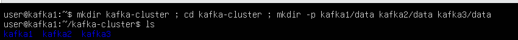

1.1 將三個目錄的權限修改成全開（因為目前還在測試環境）


```

sudo chmod -R 777 kafka1 kafka2 kafka3

```


2. 安裝 Docker

2.1 按照 docker 官方的做法用 apt respository 安裝


```

# Add Docker's official GPG key:
sudo apt update
sudo apt install ca-certificates curl
sudo install -m 0755 -d /etc/apt/keyrings
sudo curl -fsSL https://download.docker.com/linux/ubuntu/gpg -o /etc/apt/keyrings/docker.asc
sudo chmod a+r /etc/apt/keyrings/docker.asc
# Add the repository to Apt sources:
sudo tee /etc/apt/sources.list.d/docker.sources <<EOF
Types: deb
URIs: https://download.docker.com/linux/ubuntu
Suites: $(. /etc/os-release && 
echo
 
"
${UBUNTU_CODENAME:-$VERSION_CODENAME}
"
)
Components: stable
Signed-By: /etc/apt/keyrings/docker.asc
EOF
sudo apt update

```


2.2 安裝 Docker package


```

sudo apt install docker-ce docker-ce-cli containerd.io docker-buildx-plugin docker-compose-plugin

```


2.3 用 sudo docker run hello-world 檢驗 Docker 是否有起來

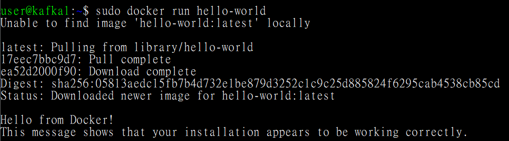

2.4 務必也要安裝 docker compose 的套件


```

sudo apt install docker-compose

```


3. 在 kafka-cluster 裡建立 docker-compose.yml

3.1 先確認 docker-compose 存在


3.2 建立 Kafka 的 docker-compose.yml (依照此網站的[範本](https://medium.com/@darshak.kachchhi/setting-up-a-kafka-cluster-using-docker-compose-a-step-by-step-guide-a1ee5972b122)去修改)


```

version: 
'3.8'
networks: kafka-net:
    driver: 
bridge
services: kafka1:
    image: 
confluentinc/cp-kafka:7.8.0
    hostname: 
kafka1
    container_name: 
kafka1
    ports: -
 
"9092:9092"
      -"9093:9093"
    environment: KAFKA_NODE_ID: 
1
      KAFKA_PROCESS_ROLES: 
'broker,controller'
      KAFKA_CONTROLLER_QUORUM_VOTERS: 
'1@kafka1:9093,2@kafka2:9093,3@kafka3:9093'
      KAFKA_LISTENERS: 
'INTERNAL://0.0.0.0:29092,EXTERNAL://0.0.0.0:9092,CONTROLLER://0.0.0.0:9093'
      
# 已經填入你的 VM IP
      KAFKA_ADVERTISED_LISTENERS: 
'INTERNAL://kafka1:29092,EXTERNAL://192.168.232.131:9092'
      KAFKA_LISTENER_SECURITY_PROTOCOL_MAP: 
'INTERNAL:PLAINTEXT,EXTERNAL:PLAINTEXT,CONTROLLER:PLAINTEXT'
      KAFKA_INTER_BROKER_LISTENER_NAME: 
'INTERNAL'
      KAFKA_CONTROLLER_LISTENER_NAMES: 
'CONTROLLER'
      CLUSTER_ID: 
'EmptNWtoR4GGWx-BH6nGLQ'
      KAFKA_HEAP_OPTS: 
"-Xms256M -Xmx256M"
      KAFKA_OFFSETS_TOPIC_REPLICATION_FACTOR: 
3
      KAFKA_DEFAULT_REPLICATION_FACTOR: 
3
      KAFKA_MIN_INSYNC_REPLICAS: 
2
    volumes: -
 
./kafka1/data:/var/lib/kafka/data
    networks: -
 
kafka-net
  kafka2: image: 
confluentinc/cp-kafka:7.8.0
    hostname: 
kafka2
    container_name: 
kafka2
    ports: -
 
"9094:9092"
      -"9095:9093"
    environment: KAFKA_NODE_ID: 
2
      KAFKA_PROCESS_ROLES: 
'broker,controller'
      KAFKA_CONTROLLER_QUORUM_VOTERS: 
'1@kafka1:9093,2@kafka2:9093,3@kafka3:9093'
      KAFKA_LISTENERS: 
'INTERNAL://0.0.0.0:29092,EXTERNAL://0.0.0.0:9092,CONTROLLER://0.0.0.0:9093'
      KAFKA_ADVERTISED_LISTENERS: 
'INTERNAL://kafka2:29092,EXTERNAL://192.168.232.131:9094'
      KAFKA_LISTENER_SECURITY_PROTOCOL_MAP: 
'INTERNAL:PLAINTEXT,EXTERNAL:PLAINTEXT,CONTROLLER:PLAINTEXT'
      KAFKA_INTER_BROKER_LISTENER_NAME: 
'INTERNAL'
      KAFKA_CONTROLLER_LISTENER_NAMES: 
'CONTROLLER'
      CLUSTER_ID: 
'EmptNWtoR4GGWx-BH6nGLQ'
      KAFKA_HEAP_OPTS: 
"-Xms256M -Xmx256M"
      KAFKA_OFFSETS_TOPIC_REPLICATION_FACTOR: 
3
      KAFKA_DEFAULT_REPLICATION_FACTOR: 
3
      KAFKA_MIN_INSYNC_REPLICAS: 
2
    volumes: -
 
./kafka2/data:/var/lib/kafka/data
    networks: -
 
kafka-net
  kafka3: image: 
confluentinc/cp-kafka:7.8.0
    hostname: 
kafka3
    container_name: 
kafka3
    ports: -
 
"9096:9092"
      -"9097:9093"
    environment: KAFKA_NODE_ID: 
3
      KAFKA_PROCESS_ROLES: 
'broker,controller'
      KAFKA_CONTROLLER_QUORUM_VOTERS: 
'1@kafka1:9093,2@kafka2:9093,3@kafka3:9093'
      KAFKA_LISTENERS: 
'INTERNAL://0.0.0.0:29092,EXTERNAL://0.0.0.0:9092,CONTROLLER://0.0.0.0:9093'
      KAFKA_ADVERTISED_LISTENERS: 
'INTERNAL://kafka3:29092,EXTERNAL://192.168.232.131:9096'
      KAFKA_LISTENER_SECURITY_PROTOCOL_MAP: 
'INTERNAL:PLAINTEXT,EXTERNAL:PLAINTEXT,CONTROLLER:PLAINTEXT'
      KAFKA_INTER_BROKER_LISTENER_NAME: 
'INTERNAL'
      KAFKA_CONTROLLER_LISTENER_NAMES: 
'CONTROLLER'
      CLUSTER_ID: 
'EmptNWtoR4GGWx-BH6nGLQ'
      KAFKA_HEAP_OPTS: 
"-Xms256M -Xmx256M"
      KAFKA_OFFSETS_TOPIC_REPLICATION_FACTOR: 
3
      KAFKA_DEFAULT_REPLICATION_FACTOR: 
3
      KAFKA_MIN_INSYNC_REPLICAS: 
2
    volumes: -
 
./kafka3/data:/var/lib/kafka/data
    networks: -
 
kafka-net
  kafka-ui:
    image: 
provectuslabs/kafka-ui:latest
    container_name: 
kafka-cluster-ui
    ports: -
 
"8080:8080"
    environment: KAFKA_CLUSTERS_0_NAME: 
local
      KAFKA_CLUSTERS_0_BOOTSTRAPSERVERS: kafka1:29092,kafka2:29092,kafka3:29092
    depends_on: -
 
kafka1
      -kafka2
      -kafka3
    networks: -
 
kafka-net

```


---

## 

## Lab 實作

### 起 Kafka 容器

1. cd 到先前創建好的 kafka-cluster 目錄使用 docker-compose up -d
2. 確保容器有順利起來（如下圖）

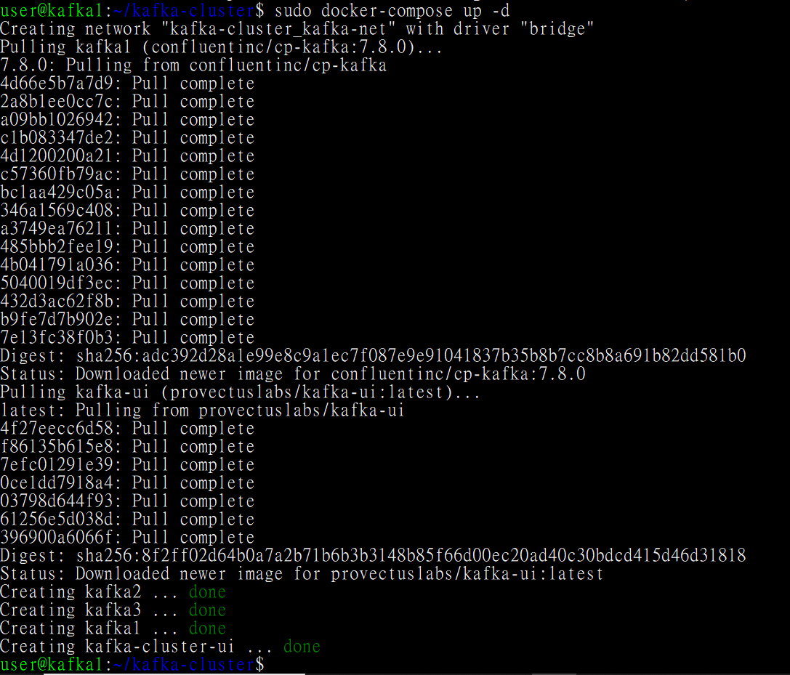

### 進行基本驗證（非高可用性的驗證）

1. 在放 docker-compose.yml 的目錄中建立 kafka\_check.sh 。


```

#!/usr/bin/env bash
set
 -euo pipefail
BOOTSTRAP_SERVER=
"
${1:-localhost:9092}
"
TOPIC=
"
${2:-healthcheck-topic}
"
echo
 
"== Kafka Health Check =="
echo
 
"Bootstrap: 
$BOOTSTRAP_SERVER
"
echo
 
"Topic:     
$TOPIC
"
echo
# 1) 檢查 broker 是否可連線 + topic 是否可列出
echo
 
"[1/4] Checking broker connectivity..."
kafka-topics.sh --bootstrap-server 
"
$BOOTSTRAP_SERVER
"
 --list > /dev/null
echo
 
"OK: broker reachable"
echo
# 2) 確保 topic 存在 (不存在就建立)
echo
 
"[2/4] Ensuring topic exists..."
if
 kafka-topics.sh --bootstrap-server 
"
$BOOTSTRAP_SERVER
"
 --describe --topic 
"
$TOPIC
"
 > /dev/null 2>&1; 
then
  
echo
 
"OK: topic exists"
else
  kafka-topics.sh --bootstrap-server 
"
$BOOTSTRAP_SERVER
"
 \
    --create --topic 
"
$TOPIC
"
 --partitions 1 \
    --replication-factor 1 > /dev/null
  
echo
 
"OK: topic created"
fi
echo
# 3) Produce 一筆測試訊息 (帶唯一 ID)
MSG=
"healthcheck-
$(date +%s)
-
$RANDOM
"
echo
 
"[3/4] Producing message: 
$MSG
"
echo
 
"
$MSG
"
 | kafka-console-producer.sh --bootstrap-server 
"
$BOOTSTRAP_SERVER
"
 --topic 
"
$TOPIC
"
 > /dev/null
echo
 
"OK: produced"
echo
# 4) Consume 讀回來 (只讀 1 筆, 避免卡住)
echo
 
"[4/4] Consuming message..."
RECV=$(kafka-console-consumer.sh \
  --bootstrap-server 
"
$BOOTSTRAP_SERVER
"
 \
  --topic 
"
$TOPIC
"
 \
  --from-beginning \
  --timeout-ms 5000 \
  --max-messages 10 2>/dev/null | grep 
"
$MSG
"
 || 
true
)
if
 [[ 
"
$RECV
"
 == 
"
$MSG
"
 ]]; 
then
  
echo
  
echo
 
"✅ SUCCESS: Kafka is working (produce/consume verified)"
  
exit
 0
else
  
echo
  
echo
 
"❌ FAIL: did not receive produced message"
  
exit
 1
fi

```


2. 修改 kafka\_check.sh 權限。


```

chmod +x kafka_check.sh

```


3. 把 kafka\_check.sh 複製到容器(kafka1)內，因為環境要求要有 kafka CLI。


```

sudo docker cp kafka_check.sh kafka1:/tmp/kafka_check.sh

```


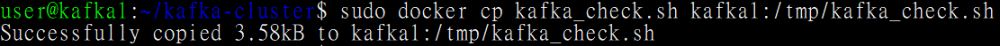

4. 進入容器 kafka1


```

sudo docker 
exec
 -it kafka1 bash ## bash 是指定要用什麼語言

```


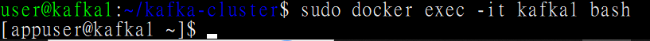

5. 進入到容器的 /tmp 目錄下，確認有執行 kafka\_check.sh 的權限後執行之；參數的部分有兩個要設定，一個是要從內部網路進入，在 yaml 檔中已設定為 29092 ，第二個參數是我們要測的 topic 名稱，預設是 healthcheck-topic ，但我們也把參數指定好。


```

./kafka_check.sh kafka1:29092 healthcheck-topic

```


5.1 遇到報錯，它說找不到工具。

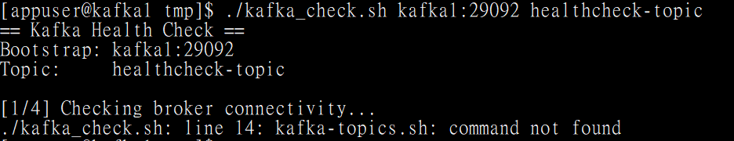

5.2 用指令搜尋工具，發現其實腳本在，只是少了sh的副檔名。

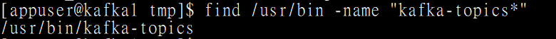

5.3 修改原本的 kafka\_check.sh ，把所有要調用的腳本的 ”.sh” 刪除。

---

5.4 第一次嘗試，失敗。有可能是因為metadata還沒有同步，而且還在選

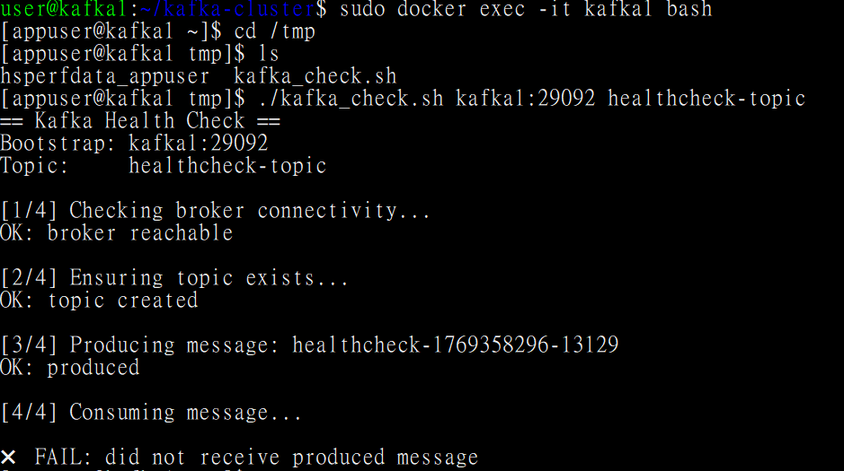

6. 第二次嘗試，成功。

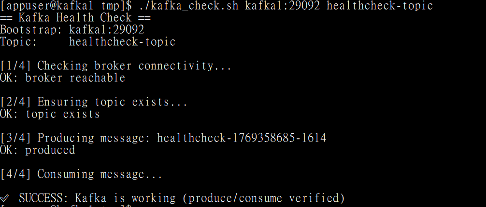

7. 可以透過下列指令去看到 metadata 以清楚看到目前的 replicator 設定（目前顯然不具高可用性，副本只有1個），當前的 Leader Broker 和 Leader Controller 都是3號。

- 看資料層 (Topic/Partition/Leader)


```

/usr/bin/kafka-topics --bootstrap-server kafka1:29092 --describe --topic healthcheck-topic

```


- 看管理層狀態 (Controller Leader):


```

/usr/bin/kafka-metadata-quorum --bootstrap-server kafka1:29092 describe --status

```


- 看管理層成員 (Controller 同步狀況)


```

/usr/bin/kafka-metadata-quorum --bootstrap-server kafka1:29092 describe --replication

```


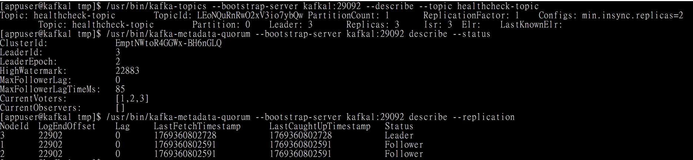

### Lab1：高可用性實作驗證

1. 建立一個新的 Topic ，在建立時就設定好有 3 個副本。


```

sudo docker 
exec
 -it kafka1 kafka-topics --create --bootstrap-server localhost:9092 --topic ha-test-topic --partitions 3 --replication-factor 3

```


2. 驗證目前的 Topic, Partition, Leader, Replica 的狀態。


```

sudo docker 
exec
 -it kafka1 kafka-topics --describe --bootstrap-server localhost:9092 --topic ha-test-topic

```


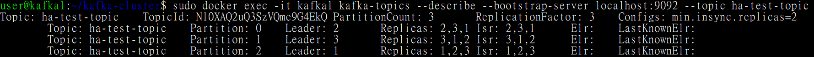

可以明顯看到負載均衡，每個 Partition 由一個 Broker 當 Leader ，而且副本也都有放在其他 Broker 上。此外，由於我們有「進入」容器內，所以直接用 9092 port 即可。

3. 進入到 Kafka1 啟動 Kafka 的生產者工具，並在剛剛新建的 Topic 下傳遞訊息。最重要的是設定 acks=all ，這個設定會使所有 ISR 的資料都同步才算成功。我在第一個 Powershell SSH 分頁操作。


```

sudo docker 
exec
 -it kafka1 kafka-console-producer --bootstrap-server localhost:9092 --topic ha-test-topic --producer-property acks=all

```


4. 第二個 Powershell SSH 分頁上，我們透過 describe 來觀察傳輸訊息後的狀況。


```

sudo docker 
exec
 -it kafka1 kafka-topics --describe --bootstrap-server localhost:9092 --topic ha-test-topic

```


5. 第三個 Powershell SSH 分頁上，我們做好等等驗證 HA 的預備：暫停 Kafka 2。


```

sudo docker stop kafka2

```


6. 第四個 Powershell SSH 分頁上，我們模擬 Consumer。


```

sudo docker 
exec
 -it kafka1 kafka-console-consumer --bootstrap-server localhost:9092 --topic ha-test-topic --from-beginning

```


7. 檢視目前 Producer 和 Consumer 的運作。

Producer

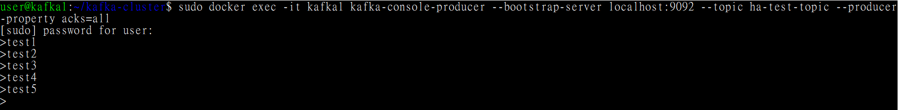

Consumer

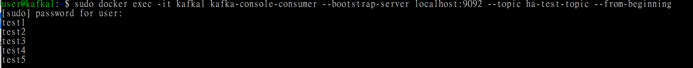

8. 關掉 kafka2 ，這意味著我們將損失一名 Broker ， Leader Election 會在此時啟動。


透過 describe 觀察結果，原本 Broker2 的工作經過投票後被 coordinator 分給 Broker3。同時，我們也可以觀察到 ISR 只剩下 2，已屆組態中的最低要求數目。

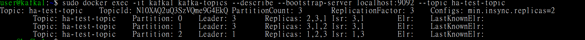

9. 接著我們再關掉 Kafka3，試著讓副本數目不可能等於或大於2，驗證無法讀寫的情況。


describe 狀況如下

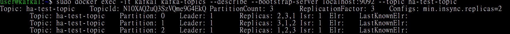

回到 producer 和 consumer 看，發現由於低於 ISR ，完全無法進行讀寫。

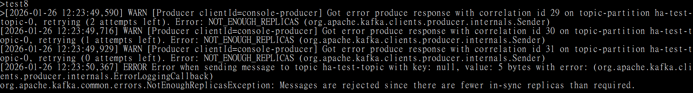

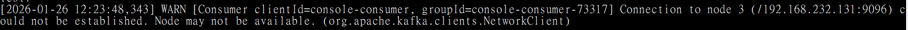

10. 將兩台 kafka 都恢復。


```

sudo docker start kafka2 kafka3

```


查看 describe 的情況，居然出現了 Broker1 過度負載的情況。

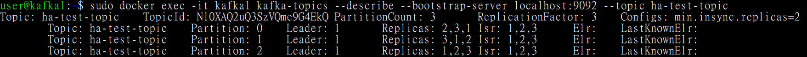

11. 我們必須修正這個過載的情形，進入到 kafka1 內，執行偏好副本的指令，重新選舉。


```

sudo docker 
exec
 -it kafka1 kafka-leader-election --bootstrap-server localhost:9092 --election-type preferred --all-topic-partitions

```


一切都恢復正常

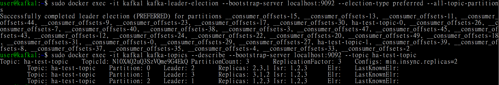

12. 其實在 Broker 的 config 裡面，已經把自動重選的參數設定為 true ，但由於要等預設的300秒，就算整體的 Broker 傾斜率已超過 10% 門檻，還是沒有辦法立即見效，下面兩條指令可以分別動態調整參數，不用關容器。

調整檢查 Broker 負載的時間間隔(此處以30秒為例)


```

sudo docker 
exec
 -it kafka1 kafka-configs --bootstrap-server localhost:9092 --alter --entity-type brokers --entity-name 1 --add-config leader.imbalance.check.interval.seconds=30

```


調整 Broker 負載傾斜率(多少負擔集中在特定 Broker 上)(此處以極端的 1% 為例)


```

sudo docker 
exec
 -it kafka1 kafka-configs --bootstrap-server localhost:9092 --alter --entity-type brokers --entity-name 1 --add-config leader.imbalance.per.broker.percentage=1

```


---

### 

### Lab2： Consumer Group Rebalance & Offset Commit

1. 開兩個獨立的 Powershell 視窗，分別當作 Consumer 1 跟 Consumer 2，它們在同一個 Consumer Group 裡面。在創建群組時，我們也加入了能夠顯示訊息來源的參數。視窗此時應該顯示等待訊息的狀態。


```

sudo docker 
exec
 -it kafka1 kafka-console-consumer --bootstrap-server localhost:9092 --topic ha-test-topic --group my-lab-group --property print.partition=
true

```


2. 進到 Prodocer 的畫面開始傳送訊息，結果在嘗試的時候發現了 Sticky Partitioner 的機制，訊息全部都跑去 Partition 0，然後也由特定 Consumer 在處理。

目前的分工


```

sudo docker 
exec
 -it kafka1 kafka-consumer-groups --bootstrap-server localhost:9092 --describe --group my-lab-group

```


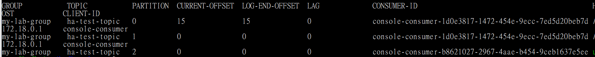

3. 重新開 Producer ，並設定讀取 key 的參數，讓它依照 key 去分配給不同的 Partition 。


```

sudo docker 
exec
 -it kafka1 kafka-console-producer  --bootstrap-server localhost:9092  --topic ha-test-topic  --property 
"parse.key=true"
  --property 
"key.separator=:"

```


4. 實際傳遞訊息與觀察 Consumer，的確如實運行且順利分配！它不會特別顯示 key 值。

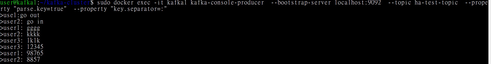

兩個 Consumer 的結果

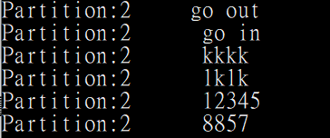

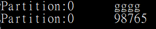

5. 殺掉負責比較多訊息處理的 Consumer ，我們要驗證 Group 內的 Rebalance 會發生。

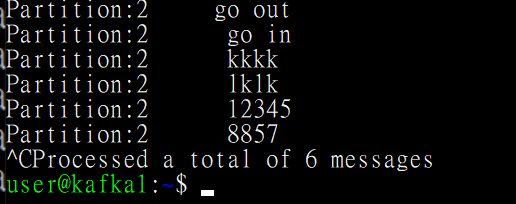

6. 在 Producer 端輸入訊息後，回頭觀察僅存的 Consumer ，它承接起它前同事的工作。

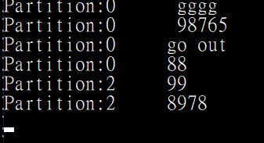

7. 我們要驗證 Offset Commit ，不重複傳訊息，是成立的，是故要讓 Consumer 死而復生。

Producer 新訊息

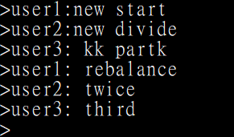

Consumer 重新上工並接到剛剛的 Commited Offset。

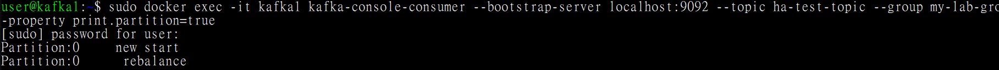

---

### 

### Lab3：高吞吐壓力測試

1. 建立一個新的 Topic 給 Performance test。


```

sudo docker 
exec
 -it kafka1 kafka-topics --create  --bootstrap-server localhost:9092  --topic perf-test  --partitions 3  --replication-factor 3

```


2. 進行不理會 ISR 的訊息高壓力測試。不管流量限制，一次給超大量紀錄。


```

sudo docker 
exec
 -it kafka1 kafka-producer-perf-test  --topic perf-test  --num-records 500000  --record-size 1024  --throughput -1  --producer-props  bootstrap.servers=localhost:9092  acks=1

```


實際運作的狀況與數值

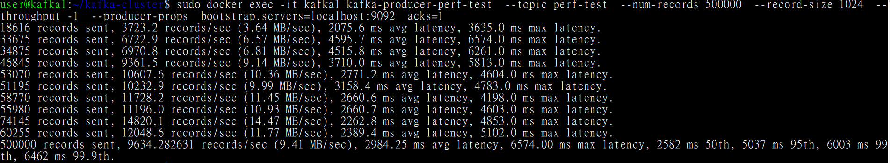

3. 我們改參數 acks=all，這會需要經過 ISR 同步才回傳成功，所以我們預期將會出現效能降低的情形。

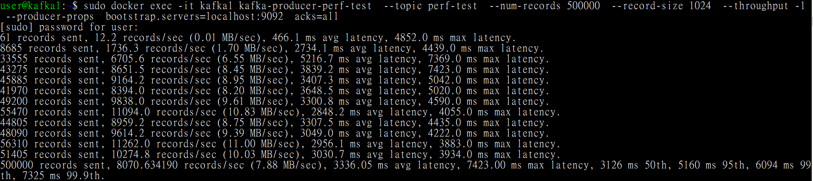

4. 研判結果，很明顯的，平均延遲速度從 2984.25 ms 變成 3336.05 ms，這是為了資料安全而付出的代價。

---

### 

### Lab4：SASL、TLS、ACL設定

1. 由於 Kafka 底層主要是用 Java 來編寫的，所以我們要用 Java 的驗證機制。首先，在與 yml 檔相同的目錄中創建以下的身分驗證組態檔 kafka\_server\_jaas.conf。裡面有兩種身分，超級管理者還有兩名普通使用者。


```

KafkaServer {
   org.apache.kafka.common.security.plain.PlainLoginModule required
   username=
"admin"
   password=
"admin-secret"
   user_admin=
"admin-secret"
   user_alice=
"alice-secret"
   user_bob=
"bob-secret"
;
};

```


2. 重設 yml 檔讓各個 kafka 可以讀取 JAAS 檔和私鑰。

2.1 新增密碼檔的掛載點（每台都要做）


```

volumes: -
 
./kafka1/data:/var/lib/kafka/data
  
# (這是原本的)
      -./kafka_server_jaas.conf:/etc/kafka/kafka_server_jaas.conf
 
      # --- 新增上面這行 ---

```


2.2 在環境的部分，做如下調整。（每台都要做）


```

environment: # ... (其他 ID、Cluster ID 等設定保持不變) ...
      
# [新增] 1. 告訴 Kafka 密碼檔在哪裡
      KAFKA_OPTS: 
"-Djava.security.auth.login.config=/etc/kafka/kafka_server_jaas.conf"
      
# [修改] 2. 定義 EXTERNAL 必須走 SASL_PLAINTEXT (原本是 PLAINTEXT)
      
# INTERNAL 維持 PLAINTEXT 是為了讓你的 Kafka-UI 和叢集內部溝通，不用改
      KAFKA_LISTENER_SECURITY_PROTOCOL_MAP: 
'INTERNAL:PLAINTEXT,EXTERNAL:SASL_SSL,CONTROLLER:PLAINTEXT'
      
# [新增] 3. 啟用 PLAIN 認證機制
      KAFKA_SASL_ENABLED_MECHANISMS: 
'PLAIN'
      KAFKA_SASL_MECHANISM_INTER_BROKER_PROTOCOL: 
'PLAINTEXT'
      
# [新增] 4. 指定 admin 為超級管理員 (對應 JAAS 檔裡的 username)
      KAFKA_SUPER_USERS: 
"User:admin"

```


有關 SSL 的環境


```

      
# [新增] SSL 憑證設定 (每一台 Broker 都要加，注意檔名對應)
      
# 告訴 Kafka：信任的 CA 在哪？
      KAFKA_SSL_TRUSTSTORE_LOCATION: 
/etc/kafka/secrets/kafka.server.truststore.jks
      KAFKA_SSL_TRUSTSTORE_PASSWORD: 
changeit
      
      
# 告訴 Kafka：我自己的身分證(私鑰)在哪？
      
# 注意：kafka1 用 kafka1.keystore.jks，kafka2 用 kafka2... 以此類推
      KAFKA_SSL_KEYSTORE_LOCATION: 
/etc/kafka/secrets/kafka1.keystore.jks
      KAFKA_SSL_KEYSTORE_PASSWORD: 
changeit
      KAFKA_SSL_KEY_PASSWORD: 
changeit
      
# [新增] 偷吃步參數 (開發環境必加)
      
# 意義：關閉 Hostname 驗證。否則用 localhost 連線時，憑證上寫 kafka1 會報錯。
      KAFKA_SSL_ENDPOINT_IDENTIFICATION_ALGORITHM: 
''

```


2.3 建立產生私鑰的腳本 [generate-ssl.sh](http://generate-ssl.sh) 。


```

#!/bin/bash
mkdir -p secrets
cd
 secrets
echo
 
"1. 產生 CA (憑證中心) [已修正: 加入 CA 標記]..."
# A. 產生 CA 私鑰與憑證 (注意最後一行的 -ext bc:c)
keytool -genkey -noprompt \
    -
alias
 ca \
    -dname 
"CN=MyCA"
 \
    -keystore kafka.server.truststore.jks \
    -keyalg RSA \
    -storepass changeit \
    -keypass changeit \
    -ext bc:c
# B. 匯出 CA 憑證
keytool -
export
 -noprompt \
    -
alias
 ca \
    -file ca-cert \
    -keystore kafka.server.truststore.jks \
    -storepass changeit
# 幫 3 台 Broker 產生憑證
for
 i 
in
 1 2 3; 
do
    
echo
 
"2. 正在幫 kafka
$i
 產生憑證..."
    
    
# C. 產生 Keystore
    keytool -genkey -noprompt \
        -
alias
 kafka
$i
 \
        -dname 
"CN=kafka
$i
"
 \
        -keystore kafka
$i
.keystore.jks \
        -keyalg RSA \
        -storepass changeit \
        -keypass changeit \
        -ext SAN=DNS:kafka
$i
,DNS:localhost,IP:127.0.0.1,IP:192.168.232.131
    
# D. 產生簽署請求 (CSR)
    keytool -certreq -noprompt \
        -
alias
 kafka
$i
 \
        -keystore kafka
$i
.keystore.jks \
        -file kafka
$i
.csr \
        -storepass changeit
    
# E. 用 CA 簽名
    keytool -gencert -noprompt \
        -
alias
 ca \
        -keystore kafka.server.truststore.jks \
        -infile kafka
$i
.csr \
        -outfile kafka
$i
-cert-signed \
        -storepass changeit \
        -ext SAN=DNS:kafka
$i
,DNS:localhost,IP:127.0.0.1,IP:192.168.232.131
    
# F. 匯入憑證 chain
    keytool -import -noprompt \
        -
alias
 ca \
        -keystore kafka
$i
.keystore.jks \
        -file ca-cert \
        -storepass changeit
    
    keytool -import -noprompt \
        -
alias
 kafka
$i
 \
        -keystore kafka
$i
.keystore.jks \
        -file kafka
$i
-cert-signed \
        -storepass changeit
        
    
echo
 
"kafka
$i
 完成！"
done
# 清理暫存檔
rm ca-cert *.csr *-cert-signed
echo
 
"=== 全部完成！憑證都在 secrets/ 資料夾內 ==="

```


2.4 修改 sh 檔的權限：chmod +x [generate-ssl.sh](http://generate-ssl.sh)，但第一時間會報錯，因為乾淨的 ubuntu 上面並沒有 Java ，所以改借用一個容器(Kafka，裡面一定有 Java )來執行腳本。容器用完就直接刪除。


```

sudo docker run --rm -v 
"
$(pwd)
"
:/work -w /work confluentinc/cp-kafka:7.8.0 bash ./generate-ssl.sh

```


2.5 執行，得到一個 secrets 的資料夾以及三把鑰匙。但這三把鑰匙所在的 secrets 權限一開始會是 root ，我們要改成 User。


```

sudo chown -R 
$USER
:
$USER
 secrets

```


用 ls -l 檢查。

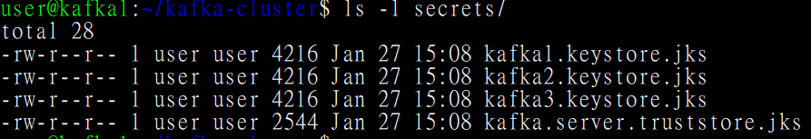

3. 以下是完整的修改後的 yml 檔。


```

version: 
'3.8'
networks: kafka-net:
    driver: 
bridge
services: kafka1:
    image: 
confluentinc/cp-kafka:7.8.0
    hostname: 
kafka1
    container_name: 
kafka1
    ports: -
 
"9092:9092"
      -"9093:9093"
    environment: KAFKA_NODE_ID: 
1
      KAFKA_PROCESS_ROLES: 
'broker,controller'
      KAFKA_CONTROLLER_QUORUM_VOTERS: 
'1@kafka1:9093,2@kafka2:9093,3@kafka3:9093'
      KAFKA_LISTENERS: 
'INTERNAL://kafka1:29092,EXTERNAL://0.0.0.0:9092,CONTROLLER://0.0.0.0:9093'
      
# 注意：請確認 IP 192.168.232.131 是正確的
      KAFKA_ADVERTISED_LISTENERS: 
'INTERNAL://kafka1:29092,EXTERNAL://192.168.232.131:9092'
      
      
# === 安全設定開始 (SASL_SSL) ===
      
# 1. 載入 SASL 帳號密碼設定
      KAFKA_OPTS: 
"-Djava.security.auth.login.config=/etc/kafka/kafka_server_jaas.conf"
      
      
# 2. 定義協定：外部連線使用 SASL_SSL (加密+登入)
      
# 內部溝通維持 PLAINTEXT 以簡化管理
      KAFKA_LISTENER_SECURITY_PROTOCOL_MAP: 
'INTERNAL:PLAINTEXT,EXTERNAL:SASL_SSL,CONTROLLER:PLAINTEXT'
      
      
# 3. 啟用 PLAIN 認證機制
      KAFKA_SASL_ENABLED_MECHANISMS: 
'PLAIN'
      KAFKA_SASL_MECHANISM_INTER_BROKER_PROTOCOL: 
'PLAINTEXT'
      
      
# 4. 指定管理員
      KAFKA_SUPER_USERS: 
"User:admin"
      
# 5. SSL 憑證設定 (Kafka 1 專用)
      KAFKA_SSL_TRUSTSTORE_LOCATION: 
/etc/kafka/secrets/kafka.server.truststore.jks
      KAFKA_SSL_TRUSTSTORE_PASSWORD: 
changeit
      KAFKA_SSL_KEYSTORE_LOCATION: 
/etc/kafka/secrets/kafka1.keystore.jks
      KAFKA_SSL_KEYSTORE_PASSWORD: 
changeit
      KAFKA_SSL_KEY_PASSWORD: 
changeit
      
      
# 6. 開發環境專用：關閉 Hostname 驗證 (避免 localhost 連線報錯)
      KAFKA_SSL_ENDPOINT_IDENTIFICATION_ALGORITHM: 
''
      
# === 安全設定結束 ===
      KAFKA_INTER_BROKER_LISTENER_NAME: 
'INTERNAL'
      KAFKA_CONTROLLER_LISTENER_NAMES: 
'CONTROLLER'
      CLUSTER_ID: 
'EmptNWtoR4GGWx-BH6nGLQ'
      KAFKA_HEAP_OPTS: 
"-Xms256M -Xmx256M"
      KAFKA_OFFSETS_TOPIC_REPLICATION_FACTOR: 
3
      KAFKA_DEFAULT_REPLICATION_FACTOR: 
3
      KAFKA_MIN_INSYNC_REPLICAS: 
2
    volumes: -
 
./kafka1/data:/var/lib/kafka/data
      -./kafka_server_jaas.conf:/etc/kafka/kafka_server_jaas.conf
      -./secrets:/etc/kafka/secrets
  
# 掛載憑證
    networks: -
 
kafka-net
  kafka2: image: 
confluentinc/cp-kafka:7.8.0
    hostname: 
kafka2
    container_name: 
kafka2
    ports: -
 
"9094:9092"
      -"9095:9093"
    environment: KAFKA_NODE_ID: 
2
      KAFKA_PROCESS_ROLES: 
'broker,controller'
      KAFKA_CONTROLLER_QUORUM_VOTERS: 
'1@kafka1:9093,2@kafka2:9093,3@kafka3:9093'
      KAFKA_LISTENERS: 
'INTERNAL://kafka2:29092,EXTERNAL://0.0.0.0:9092,CONTROLLER://0.0.0.0:9093'
      KAFKA_ADVERTISED_LISTENERS: 
'INTERNAL://kafka2:29092,EXTERNAL://192.168.232.131:9094'
      
      
# === 安全設定 (SASL_SSL) ===
      KAFKA_OPTS: 
"-Djava.security.auth.login.config=/etc/kafka/kafka_server_jaas.conf"
      KAFKA_LISTENER_SECURITY_PROTOCOL_MAP: 
'INTERNAL:PLAINTEXT,EXTERNAL:SASL_SSL,CONTROLLER:PLAINTEXT'
      KAFKA_SASL_ENABLED_MECHANISMS: 
'PLAIN'
      KAFKA_SASL_MECHANISM_INTER_BROKER_PROTOCOL: 
'PLAINTEXT'
      KAFKA_SUPER_USERS: 
"User:admin"
      
# SSL 設定 (Kafka 2 專用)
      KAFKA_SSL_TRUSTSTORE_LOCATION: 
/etc/kafka/secrets/kafka.server.truststore.jks
      KAFKA_SSL_TRUSTSTORE_PASSWORD: 
changeit
      KAFKA_SSL_KEYSTORE_LOCATION: 
/etc/kafka/secrets/kafka2.keystore.jks
      KAFKA_SSL_KEYSTORE_PASSWORD: 
changeit
      KAFKA_SSL_KEY_PASSWORD: 
changeit
      KAFKA_SSL_ENDPOINT_IDENTIFICATION_ALGORITHM: 
''
      
# =========================
      KAFKA_INTER_BROKER_LISTENER_NAME: 
'INTERNAL'
      KAFKA_CONTROLLER_LISTENER_NAMES: 
'CONTROLLER'
      CLUSTER_ID: 
'EmptNWtoR4GGWx-BH6nGLQ'
      KAFKA_HEAP_OPTS: 
"-Xms256M -Xmx256M"
      KAFKA_OFFSETS_TOPIC_REPLICATION_FACTOR: 
3
      KAFKA_DEFAULT_REPLICATION_FACTOR: 
3
      KAFKA_MIN_INSYNC_REPLICAS: 
2
    volumes: -
 
./kafka2/data:/var/lib/kafka/data
      -./kafka_server_jaas.conf:/etc/kafka/kafka_server_jaas.conf
      -./secrets:/etc/kafka/secrets
    networks: -
 
kafka-net
  kafka3: image: 
confluentinc/cp-kafka:7.8.0
    hostname: 
kafka3
    container_name: 
kafka3
    ports: -
 
"9096:9092"
      -"9097:9093"
    environment: KAFKA_NODE_ID: 
3
      KAFKA_PROCESS_ROLES: 
'broker,controller'
      KAFKA_CONTROLLER_QUORUM_VOTERS: 
'1@kafka1:9093,2@kafka2:9093,3@kafka3:9093'
      KAFKA_LISTENERS: 
'INTERNAL://kafka3:29092,EXTERNAL://0.0.0.0:9092,CONTROLLER://0.0.0.0:9093'
      KAFKA_ADVERTISED_LISTENERS: 
'INTERNAL://kafka3:29092,EXTERNAL://192.168.232.131:9096'
      
      
# === 安全設定 (SASL_SSL) ===
      KAFKA_OPTS: 
"-Djava.security.auth.login.config=/etc/kafka/kafka_server_jaas.conf"
      KAFKA_LISTENER_SECURITY_PROTOCOL_MAP: 
'INTERNAL:PLAINTEXT,EXTERNAL:SASL_SSL,CONTROLLER:PLAINTEXT'
      KAFKA_SASL_ENABLED_MECHANISMS: 
'PLAIN'
      KAFKA_SASL_MECHANISM_INTER_BROKER_PROTOCOL: 
'PLAINTEXT'
      KAFKA_SUPER_USERS: 
"User:admin"
      
# SSL 設定 (Kafka 3 專用)
      KAFKA_SSL_TRUSTSTORE_LOCATION: 
/etc/kafka/secrets/kafka.server.truststore.jks
      KAFKA_SSL_TRUSTSTORE_PASSWORD: 
changeit
      KAFKA_SSL_KEYSTORE_LOCATION: 
/etc/kafka/secrets/kafka3.keystore.jks
      KAFKA_SSL_KEYSTORE_PASSWORD: 
changeit
      KAFKA_SSL_KEY_PASSWORD: 
changeit
      KAFKA_SSL_ENDPOINT_IDENTIFICATION_ALGORITHM: 
''
      
# =========================
      KAFKA_INTER_BROKER_LISTENER_NAME: 
'INTERNAL'
      KAFKA_CONTROLLER_LISTENER_NAMES: 
'CONTROLLER'
      CLUSTER_ID: 
'EmptNWtoR4GGWx-BH6nGLQ'
      KAFKA_HEAP_OPTS: 
"-Xms256M -Xmx256M"
      KAFKA_OFFSETS_TOPIC_REPLICATION_FACTOR: 
3
      KAFKA_DEFAULT_REPLICATION_FACTOR: 
3
      KAFKA_MIN_INSYNC_REPLICAS: 
2
    volumes: -
 
./kafka3/data:/var/lib/kafka/data
      -./kafka_server_jaas.conf:/etc/kafka/kafka_server_jaas.conf
      -./secrets:/etc/kafka/secrets
    networks: -
 
kafka-net
  kafka-ui:
    image: 
provectuslabs/kafka-ui:latest
    container_name: 
kafka-cluster-ui
    ports: -
 
"8080:8080"
    environment: KAFKA_CLUSTERS_0_NAME: 
local
      
# 這裡走 INTERNAL port (29092)，維持 PLAINTEXT，所以 UI 不需要改 SSL 設定
      KAFKA_CLUSTERS_0_BOOTSTRAPSERVERS: kafka1:29092,kafka2:29092,kafka3:29092
    networks: -
 
kafka-net

```


4. 修改後記得先把原本的容器 sudo docker-compose down 再重啟。

5. 建立 topic。


```

sudo docker 
exec
 kafka1 kafka-topics \
  --create \
  --topic ha-test-topic \
  --partitions 3 \
  --replication-factor 3 \
  --bootstrap-server kafka1:29092

```


6. 在 kafka-cluster 的目錄中建立一個 client 的 properties 檔，以說明這個 client 要用 SSL 加密，我要用 admin 登入，而且我相信那個 Truststore。


```

# 1. 安全協定：SASL + SSL
security.protocol=SASL_SSL
sasl.mechanism=PLAIN
# 2. 帳號密碼 (這裡是 admin)
sasl.jaas.config=org.apache.kafka.common.security.plain.PlainLoginModule required username=
"admin"
 password=
"admin-secret"
;
# 3. SSL 信任設定 (Client 只需要 Truststore)
# 注意：這裡的路徑是指「容器內的路徑」，等一下我們會掛載進去
ssl.truststore.location=/etc/kafka/secrets/kafka.server.truststore.jks
ssl.truststore.password=changeit
# 4. 如果是用 IP 連線，為了避免 SSL 檢查主機名稱報錯，先關掉驗證
ssl.endpoint.identification.algorithm=

```


7. 啟用一個容器作為免洗的 client，來印證加密是否成功。


```

sudo docker run --rm -it --network host \
  -v $(
pwd
)/secrets:/etc/kafka/secrets \
  -v $(
pwd
)/client-ssl.properties:/tmp/client-ssl.properties \
  confluentinc/cp-kafka:7.8.0 \
  kafka-topics --list \
  --bootstrap-server 192.168.232.131:9092 \
  --
command
-config /tmp/client-ssl.properties

```


8. 最終成功，這個 client-admin 通過了加密驗證。

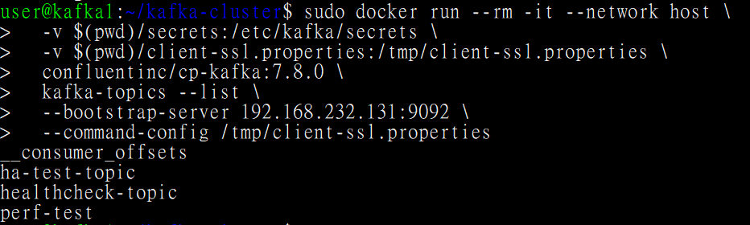

9. 接著，我們來進行一個失敗的測試：client-alice。我們要創建一個 alice 的 properties 檔。


```

security.protocol=SASL_SSL
sasl.mechanism=PLAIN
# 注意：這裡改成 Alice 的帳號密碼
sasl.jaas.config=org.apache.kafka.common.security.plain.PlainLoginModule required username=
"alice"
 password=
"alice-secret"
;
# SSL 設定跟 admin 一樣，因為大家連的是同一家銀行
ssl.truststore.location=/etc/kafka/secrets/kafka.server.truststore.jks
ssl.truststore.password=changeit
ssl.endpoint.identification.algorithm=

```


10. 設置 Kafka 本身的授權機制。在每個 Kafka 的 environment 部分新增以下的參數。


```

      # [新增] 啟用 KRaft 模式下的標準授權器 (這就是警衛)
      KAFKA_AUTHORIZER_CLASS_NAME: 
org.apache.kafka.metadata.authorizer.StandardAuthorizer
      
      
# [新增] 如果沒設定權限，預設是拒絕 (Deny) 還是允許 (Allow)？
      
# 設為 false 代表：除非我特別發權限給你，否則你什麼都不能做 (白名單制)
      KAFKA_ALLOW_EVERYONE_IF_NO_ACL_FOUND: 
'false'

```


11. 嘗試用 client-alice 去連線，結果發現整個無法連線，無法存取到 topic 。


```

sudo docker run --rm -it --network host \
  -v $(
pwd
)/secrets:/etc/kafka/secrets \
  -v $(
pwd
)/client-alice.properties:/tmp/client-alice.properties \
  confluentinc/cp-kafka:7.8.0 \
  kafka-topics --list \
  --bootstrap-server 192.168.232.131:9092 \
  --
command
-config /tmp/client-alice.properties

```


12. 由於剛剛前一個指令下去大報錯，所以需要改 superuser 的參數，讓 anonymous 的 user 也可以被視作容器內互通的對象。


```

KAFKA_SUPER_USERS: 
"User:admin;User:ANONYMOUS"

```


13. client-alice 什麼都看不到，因為權限不足。

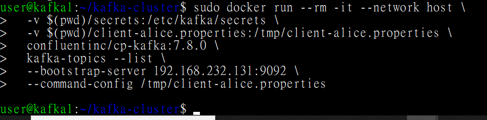

14. 接著，我們要讓 admin 授權給 client-alice ，讓它可以看特定的 topic。


```

# 注意：這裡我們要掛載 client-ssl.properties (這是 Admin 的憑證)
sudo docker run --rm -it --network host \
  -v $(
pwd
)/secrets:/etc/kafka/secrets \
  -v $(
pwd
)/client-ssl.properties:/tmp/client-ssl.properties \
  confluentinc/cp-kafka:7.8.0 \
  kafka-acls --bootstrap-server 192.168.232.131:9092 \
  --
command
-config /tmp/client-ssl.properties \
  --add \
  --allow-principal User:alice \
  --operation Describe \
  --topic ha-test-topic

```


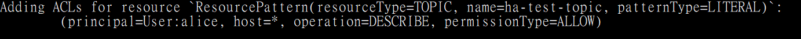

15. 讓 client-alice 再去嘗試一次，權限立即生效。

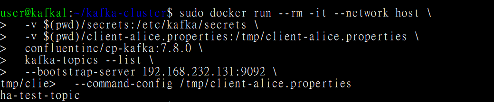

16. 收回 client-alice 的權限。


```

sudo docker run --rm -it --network host \
  -v $(
pwd
)/secrets:/etc/kafka/secrets \
  -v $(
pwd
)/client-ssl.properties:/tmp/client-ssl.properties \
  confluentinc/cp-kafka:7.8.0 \
  kafka-acls --bootstrap-server 192.168.232.131:9092 \
  --
command
-config /tmp/client-ssl.properties \
  --remove \
  --allow-principal User:alice \
  --operation Describe \
  --topic ha-test-topic

```


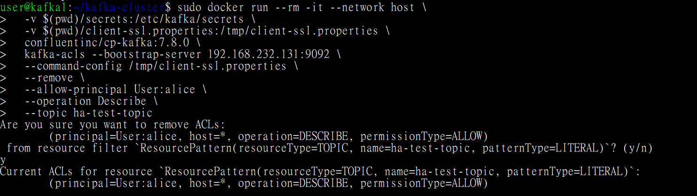

17. client-alice 變成什麼都看不到了。

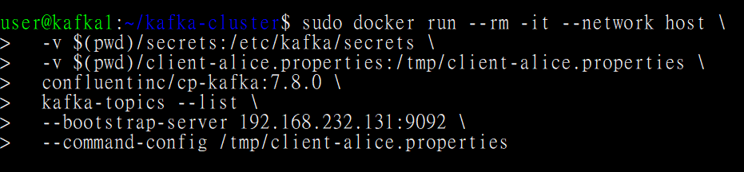

---

## 版本控制：Git

### 先推 Main 到 Repo

1. 先建立 .gitignore 檔，裡面包含下列 code ，主要是避免原始檔案上傳會帶有機密資訊。


```

# === 忽略敏感資料 (正本) ===
secrets/
*.jks
kafka_server_jaas.conf
client-ssl.properties
client-alice.properties
# 如果你的 docker-compose.yml 裡面有真密碼，也可以選擇忽略它，只傳 example
# 但通常我們會保留 docker-compose.yml，除非你不想讓人知道你的 IP 設定
# 這裡依照你的需求，如果你想完全隱藏，就忽略正本：
docker-compose.yml
# === 忽略資料存儲 (太大了不要傳) ===
kafka1/data/
kafka2/data/
kafka3/data/
# === 忽略執行檔或暫存檔 ===
*.
log
.DS_Store

```


2. 其餘所有檔案都進行 copy 並在改名中加入 example ，以和原始檔案區隔。這些改名後的檔案中，原本有提到 password 的地方，依照情境改成 YOUR\_PASSWORD 或者 SECRET\_PASSWORD。

3. 登入 github ，並依序執行下列所有指令。

3.1 身分設定


```

git config --global user.name 
"你的GitHub帳號"
git config --global user.email 
"你的Email"

```


3.2 初始化和加入檔案


```

# 1. 初始化
git init
# 2. 加入所有檔案 (Git 會自動參考 .gitignore)
git add .
# 3. 【停下來看！】檢查狀態
git status

```


3.3 提交第一版


```

# 1. 提交版本
git commit -m 
"feat: init Kafka HA Infra with KRaft, SASL/SSL and ACL"
# 2. 將分支改名為 main
git branch -M main
# 3. 連結到 GitHub (把下面的網址換成 GitHub 上面 Kafka 的 Repo 網址)
git remote add origin https://github.com/你的帳號/你的Repo名稱.git

```


Commit 後的畫面如下，它會展示所有欲上傳的檔案

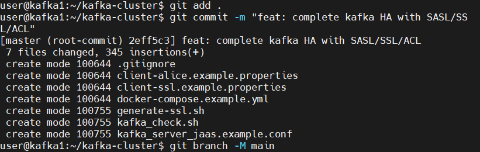

3.4 真正提交到遠端的 GitHub 個人倉庫，請做以下指令，並在提示下輸入使用者和密碼。


```

git push -u origin main

```

```

Username 
for
 
'https://github.com'
: 使用者名稱
Password 
for
 
'你的 repo http'
: token

```


最終結果

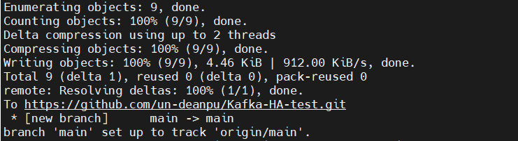

4. 由於我們前面只做了 Ubuntu 上面的檔案，我們現在要把現在這份 Google Doc 變成 README 放在 GitHub 上做最終交付物，接下來會用 Windows10 去把此份文件的文和圖上傳到 GitHub repo 的 Branch ，以避免前功盡棄。同時間，我們也可以再次練習版本控制和 CI/CD 的實作。

---

# 參考資料

### 環境建置與部署

1. [Install Docker Engine on Ubuntu](https://docs.docker.com/engine/install/ubuntu/)
2. [安裝 Docker 與 Docker Compose (plugin) on Ubuntu 24.04](https://hackmd.io/1fJbhh0CTSq8CP04QlybHQ)
3. Kafka ymal 檔參考：[Setting Up a Kafka Cluster Using Docker Compose(Kraft Mode): A Step-by-Step Guide](https://medium.com/@darshak.kachchhi/setting-up-a-kafka-cluster-using-docker-compose-a-step-by-step-guide-a1ee5972b122)

### Kafka 基礎知識

1. [Apache Kafka 是什麼？核心元件、優勢、常見使用案例一次看！](https://www.omniwaresoft.com.tw/product-news/kafka-introduction/)
2. [Danica Fine – Brick-by-Brick: Exploring the Elements of Apache Kafka®](https://www.youtube.com/watch?v=690q2H0vQzQ)
3. [Apache Kafka Architecture](https://www.youtube.com/watch?v=IsgRatCefVc)
4. [Understanding Kafka Partitioning Strategy](https://www.scaler.com/topics/kafka-tutorial/kafka-partitioning-strategy/)
5. [Kafka超新手入門第一瞥](https://chrisyen8341.medium.com/kafka%E8%B6%85%E6%96%B0%E6%89%8B%E5%85%A5%E9%96%80%E7%AC%AC%E4%B8%80%E7%9E%A5-9348a9cb23dc)

### Kafka HA 應用場景

1. [不只快，更要穩！揭開 Kafka 支撐百萬事件流的祕密](https://medium.com/@systexdatalab/%E4%B8%8D%E5%8F%AA%E5%BF%AB-%E6%9B%B4%E8%A6%81%E7%A9%A9-%E6%8F%AD%E9%96%8B-kafka-%E6%94%AF%E6%92%90%E7%99%BE%E8%90%AC%E4%BA%8B%E4%BB%B6%E6%B5%81%E7%9A%84%E7%A5%95%E5%AF%86-8bd32bf4132f)
2. [Top Kafka Use Cases You Should Know](https://www.youtube.com/watch?v=Ajz6dBp_EB4)

### Kafka HA 與 DR

1. [Apache Kafka disaster recovery & high availability](https://www.youtube.com/watch?v=LghZ7ccAdAE)
